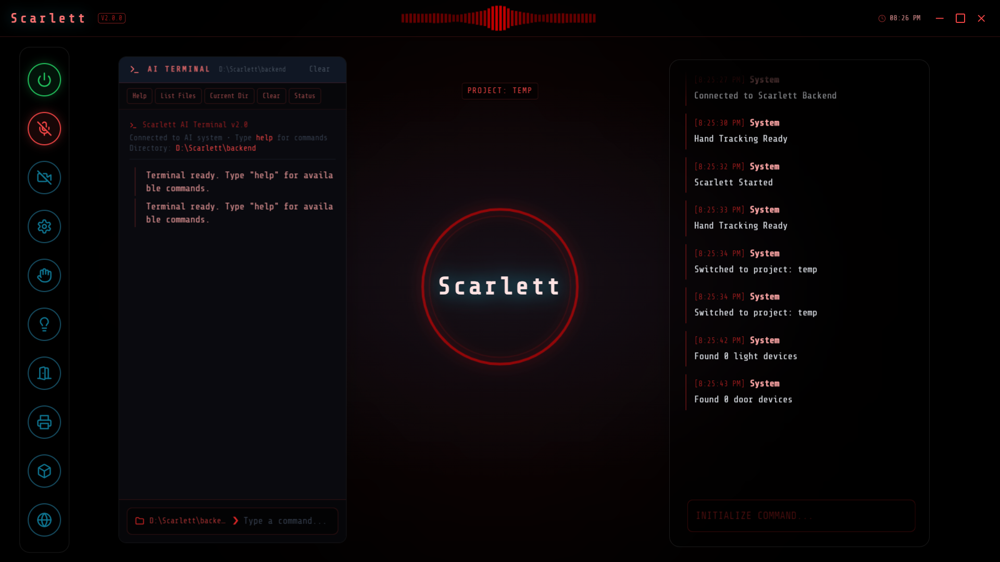

# Scarlett

**S**mart **C**onversational **A**ssistant for **R**eal-time **L**earning, **E**xecution & **T**ask **T**racking

A personal, Jarvis-style voice assistant with a real-time avatar UI, a live video feed, and a plugin system that lets it actually *do* things on your computer and around your home — not just talk about them.

Scarlett runs as a small **Electron desktop app** (React frontend) talking to a **Python backend** that streams your mic and webcam to **Google's Gemini Live API** and gets a natural, interruptible voice conversation back — with full function-calling access to a growing set of tools.

> ⚠️ **This is a personal project, published as-is.** It's built around one person's setup (their PC, their printer, their smart home devices). See [Before You Publish / Run This Yourself](#before-you-run-this-yourself) for what you'll need to change.


*(demo GIF / screenshots go here)*

---

## Table of Contents

- [What it can do](#what-it-can-do)
- [Architecture](#architecture)
- [Plugin System](#plugin-system)
- [Getting Started](#getting-started)
  - [Prerequisites](#prerequisites)
  - [Backend setup](#backend-setup)
  - [Frontend setup](#frontend-setup)
  - [Environment variables](#environment-variables)
  - [Running it](#running-it)
- [Project Structure](#project-structure)
- [Writing Your Own Plugin](#writing-your-own-plugin)
- [Before You Run This Yourself](#before-you-run-this-yourself)
- [Note](#note)
- [Contributing](#contributing)
- [License](#license)

---

## What it can do

Scarlett talks like a person (via Gemini's native-audio model), not a script — she interrupts, jokes, pushes back, and remembers things about you across the conversation. On top of that, she can:

- 🗣️ **Real-time voice conversation** — full-duplex audio in/out, live transcription of both sides, camera + screen-share vision so she can see what you see.
- 🧠 **Persistent memory** — a category-based information store she reads/writes herself (contacts, preferences, directories, "things I've learned about you") using a documented recall → match → update decision process baked into her system prompt.
- 🖥️ **Computer control** — keyboard/shortcut control, running terminal commands, reading/writing files inside project folders.
- 🌐 **Web agent** — drives a real browser (Playwright) to complete multi-step tasks, streaming a live view of the page to the UI.
- 🧊 **CAD generation** — generates and iterates parametric 3D models from natural language (via `build123d`) and shows them in an interactive viewer.
- 🖨️ **3D printing** — discovers OctoPrint/Moonraker/PrusaLink printers on the network, slices, starts prints, reports progress.
- 💡 **Smart home** — discovers and controls Kasa smart lights and smart door locks.
- 📧 **Email** — drafts and sends email in your voice/personality, from just a stated reason (no dictating subject/body).
- ♟️ **Games** — full interactive chess and backgammon matches against Scarlett, on-screen boards.
- 🎵 **Music** — search/play/control a local music library with a synced player UI.
- 🔒 **Optional face authentication** — lock/unlock the assistant with on-device face recognition (MediaPipe), off by default.
- 🧩 **A real plugin system** — every one of the features above is a self-contained plugin. Adding a new tool means adding a folder; nothing else in the app needs to change. Plugins can even be packaged (`.splugin`), shared, and installed through a UI, similar to a tiny extension marketplace.

## Architecture

```
┌──────────────────────────┐        Socket.IO / REST        ┌───────────────────────────┐        Gemini Live API
│   Electron + React UI    │ <────────────────────────────> │   Python backend          │ <────────────────────>  (audio, video,
│   (src/)                 │                                 │   FastAPI + python-       │                          function calling,
│   - avatar / audio bars  │                                 │   socketio (backend/)     │                          google_search)
│   - chat, tool windows   │                                 │   - AudioLoop (core loop) │
│   - per-plugin UI panels │                                 │   - ToolDispatcher        │
└──────────────────────────┘                                 └─────────────┬─────────────┘
                                                                             │
                                                               ┌─────────────▼─────────────┐
                                                               │   Plugin registry          │
                                                               │   backend/plugins/*        │
                                                               │   (auto-discovered)        │
                                                               └────────────────────────────┘
```

- **`backend/Scarlett.py`** owns the `AudioLoop` — the core session with Gemini Live: mic/camera capture, audio playback, transcription, and Scarlett's full system prompt/personality.
- **`backend/server.py`** is the process entry point: a FastAPI app wrapped in a Socket.IO server. It owns app-wide settings, the plugin manager REST API, and every Socket.IO event the frontend listens to.
- **`backend/core/`** holds reusable mixins (`AudioIOMixin`, `VideoIOMixin`) and `ToolDispatcher`, which replaced what used to be a 500-line `if/elif` chain of tool handling.
- **`backend/plugins/`** is where every capability lives — see [Plugin System](#plugin-system) below.
- **`src/`** is the Electron renderer: a single large `App.jsx` that owns UI state and a Socket.IO client, plus one component per feature/plugin window. `Visualizer.jsx` renders the audio-reactive avatar with Three.js (`@react-three/fiber` + `@react-three/drei`).

## Plugin System

This is the part of the codebase worth understanding first if you want to extend Scarlett.

- Each plugin is a folder under `backend/plugins/<id>/`. Its Python module registers tools with a shared `ToolRegistry` using a `@tool(...)` decorator (see `plugins/base.py`).
- `plugins/loader.py` auto-discovers and imports every plugin folder at startup — **adding a capability is just adding a folder**, nothing else needs to be wired up.
- `core/tool_dispatcher.py` routes every Gemini function call to the right plugin handler, checks whether the tool is enabled in Settings, and — for tools flagged `requires_confirmation` — pops a confirmation prompt in the UI before running.
- Plugins that need one canonical, process-wide instance (an agent, a client, a connection pool) use the `lazy_singleton` helper in `plugins/base.py`, so both a tool handler *and* an unrelated REST route in `server.py` can reach the same instance without manual wiring.
- Plugins that ship a UI window declare it in `plugin.json` under `frontend`; installing one updates `src/plugins.manifest.json` and regenerates `src/pluginRegistry.jsx` automatically (`backend/plugin_tools/registry_sync.py`) — that file is generated, never hand-edited.
- Plugins can be **packaged** (`backend/plugin_tools/exporter.py` → a `.splugin` zip) and **installed** through the in-app Plugin Manager (Settings → Full Settings → Plugin Manager), which inspects the manifest, shows the user its pip/npm dependencies and requested permissions, and only installs after explicit confirmation.

See [Writing Your Own Plugin](#writing-your-own-plugin) for a minimal example.

## Getting Started

### Prerequisites

- **Python 3.11+**
- **Node.js 18+** and npm
- A **Google Gemini API key** ([ai.google.dev](https://ai.google.dev)) with access to the Live API
- Windows is the primary target platform today (some tools shell out to Windows-specific commands, e.g. `cd /d` for drive switching, and use `pyautogui`/keyboard control assuming a Windows desktop). macOS/Linux will need adjustments to a few plugins.
- This is an **Electron** app on the frontend — `package.json` points its `main` entry at `electron/main.js` and `App.jsx` uses `window.require('electron')` for the frameless window controls (minimize/maximize/close). Make sure `electron/main.js`, `index.html`, `vite.config.js`, and `tailwind.config.js` exist at the repo root alongside `src/` before running — they weren't part of this README's source snapshot, so double-check they're committed.

### Backend setup

```bash
python -m venv venv
venv\Scripts\activate        # Windows

pip install -r requirements.txt
playwright install
```

> `PySide6` is in `requirements.txt` but not currently imported anywhere in `backend/` — likely a leftover from an earlier desktop-GUI iteration of this project, kept in case it's still needed. Safe to drop if you confirm nothing uses it.

### Frontend setup

```bash
npm install
```

Key runtime pieces beyond React itself: `socket.io-client` (backend connection), `@mediapipe/tasks-vision` (hand-tracking cursor), `three` + `@react-three/fiber` + `@react-three/drei` (the 3D avatar/audio visualizer), `chess.js` / `react-chessboard` (chess plugin UI), `framer-motion` (animations), and `electron` itself.

### Environment variables

Create `backend/.env`:

| Variable | Purpose |
|---|---|
| `GEMINI_API_KEY` | Google Gemini API key (Live API access) |
| `OPENWEATHER_API_KEY` | Weather lookups |
| `EMAIL_ADDRESS` | SMTP sending account (use an app password, not your real password) |
| `EMAIL_IMAP` / `EMAIL_IMAP_PORT` | IMAP server for reading mail |
| `MUSIC_FOLDER_PATH` | Root folder the music plugin searches |
| `USER_NAME` | Your real name (used in the system prompt) |
| `USER_KNOWN_AS` | What Scarlett calls you ("sir", your name, a nickname, ...) |
| `OS` | Target OS string, used by a couple of platform-specific tools |

`backend/settings.json` holds everything that changes at runtime through the Settings UI instead of `.env`: face-auth toggle, per-tool enable/disable (`tool_permissions`), known printers/Kasa devices/door locks, selected mic/speaker/webcam, and cursor sensitivity for the hand-tracking cursor. It's created with sane defaults on first run if missing.

### Running it

```bash
# terminal 1 — backend
python backend/server.py         # serves on http://127.0.0.1:8000

# terminal 2 — frontend + Electron shell
npm run dev               # starts Vite, waits for it, then launches Electron
```

`npm run dev` runs `vite` and `electron .` together (via `concurrently` + `wait-on`), so the Electron window opens automatically once the Vite dev server on port 5173 is ready. Use `npm run build` for a production Vite build and `npm start` to launch Electron against it. Hit the mic button to start talking.

## Project Structure

```
backend/
├── Scarlett.py           # AudioLoop: the Gemini Live session + system prompt
├── server.py              # FastAPI + Socket.IO entry point, settings & plugin manager API
├── authenticator.py        # Optional face-auth
├── core/
│   ├── audio_io.py         # Mic capture / speaker playback mixin
│   ├── video_io.py         # Webcam / screen-share mixin
│   └── tool_dispatcher.py  # Routes Gemini tool calls to plugin handlers
├── plugins/                # One folder per capability — see Plugin System
│   ├── base.py             # ToolRegistry, @tool decorator, lazy_singleton
│   ├── loader.py            # Auto-discovers & imports every plugin
│   ├── cad/ chess/ backgammon/ music/ printer/ smarthome/ web/  # manifest-based (installable/exportable)
│   └── cmd/ email/ files/ items/ keyboard/ project/ misc/       # built-in, no manifest
├── plugin_tools/
│   ├── importer.py          # Install a .splugin package
│   ├── exporter.py          # Package a plugin folder into a .splugin
│   └── registry_sync.py     # Keeps src/pluginRegistry.jsx generated from the manifest
└── web/full_settings.html   # Full settings page (env vars, tool permissions, plugin manager UI)

src/
├── App.jsx                  # Main renderer: layout, socket wiring, window management
├── pluginRegistry.jsx        # AUTO-GENERATED — do not hand-edit
├── plugins.manifest.json     # Source of truth for installed UI plugins
└── components/                # One component per feature/plugin window
```

## Writing Your Own Plugin

Minimal example — `backend/plugins/hello/__init__.py`:

```python
from plugins.base import tool

@tool(
    name="say_hello",
    description="Says hello to someone by name.",
    parameters={
        "type": "object",
        "properties": {"name": {"type": "string"}},
        "required": ["name"],
    },
)
async def say_hello(ctx, fc):
    name = fc.args.get("name", "there")
    return f"Hello, {name}!"
```

Restart the backend — that's it. `loader.py` picks it up automatically, `Scarlett.py` includes its schema in the Gemini `tools` list, and `ToolDispatcher` routes calls to it. Add a `plugin.json` (see any folder under `plugins/` that has one) plus a `frontend` entry if it needs a UI window, so it can also be exported/installed via the Plugin Manager.

## Before You Run This Yourself

This repo was extracted directly from a working personal setup. Before you push it publicly or hand it to someone else, go through this list:


- [ ] **`backend/plugins/email/token.json`** — Google OAuth credentials/tokens for the email plugin. Never commit these.
- [ ] **`backend/settings.json`** — contains real device info (printer name/IP, selected mic/webcam). Fine to keep structurally, but scrub personal identifiers or ship a `settings.example.json` instead and gitignore the real one.
- [ ] Add a proper **`.gitignore`** (`.env`, `venv/`, `node_modules/`, `*.token.json`, `credentials.json`, `settings.json`, `reference.jpg`, `__pycache__/`, build output).
- [ ] Confirm `electron/main.js`, `index.html`, `vite.config.js`, and `tailwind.config.js` are actually committed alongside `package.json` and `requirements.txt` — none of those four were part of what was reviewed while writing this README.

## Credits

This project began as a fork/extension of an earlier MIT-licensed assistant project by Nazir Louis. The original repository isn't linked here (link not currently available) — see [`LICENSE`](LICENSE) for the preserved original copyright notice.

## Note

This project is not compelete yet and I am working on it.
If you found a bug in this project or just need some help please let me know.
This project only tested on Windows but of someone wanted to add other OS version please let me know.
```
mahanbiabani12@gmail.com
```

## Contributing

Contributions are welcome! Here's how:

1. **Fork** the repository.
2. **Create a branch**:

   ```bash
   git checkout -b feature/amazing-feature
   ```
3. **Commit** your changes:

   ```bash
   git commit -m "Add amazing feature"
   ```
4. **Push** to the branch:

   ```bash
   git push origin feature/amazing-feature
   ```
5. **Open a Pull Request** with a clear description.


## License

MIT — see [`LICENSE`](LICENSE). Note the license file carries two copyright lines: the original author's (required to be preserved under the MIT terms of the base project) and this fork's.
